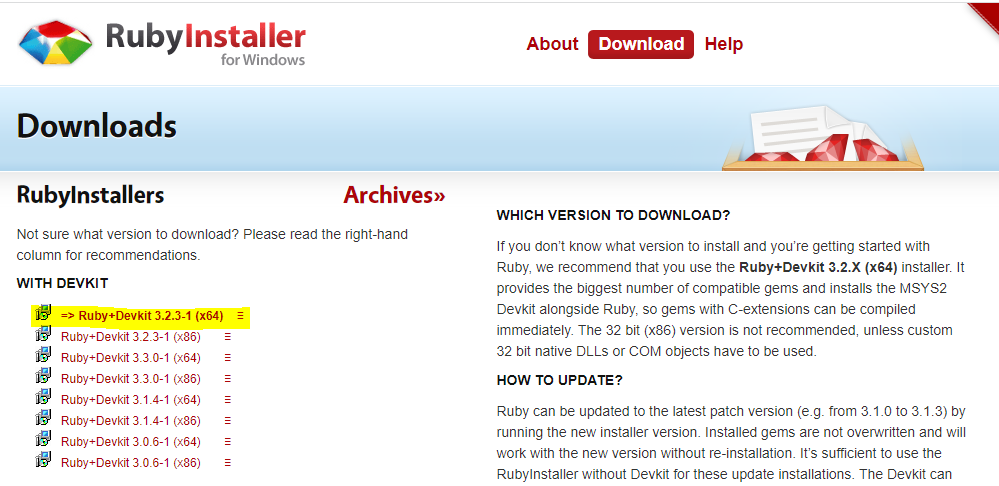
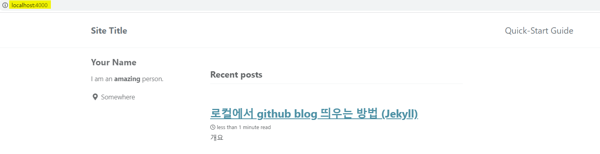

# 개요

윈도우 기준으로 로컬에서 github blog를 띄어보는 과정이다.

# 들어가기 앞서

Jekyll 테마를 사용해 깃헙에서 블로그를 이미 만들어 놓았다는 가정하에 진행할 예정이다. 만약 지금 시작하는 단계라면 아래 링크를 따라서 만들면 된다.

[깃헙(GitHub) 블로그 10분안에 완성하기-테디노트](https://youtu.be/ACzFIAOsfpM?feature=shared)

# Ruby 설치

github repository에 블로그를 만드는 것 까지 완성했다면 로컬에서 띄울 수 있게 되는데 그 전에 Ruby를 설치해야 한다. 우리가 github에서 Fork한 테마는 Jekyll 기반으로 만들어졌기 때문에 (Jekyll은 Ruby기반이다) Ruby를 설치해야한다. 아래 링크를 따라서 화살표로 표시된 버전을 클릭하여 설치하면 된다.

[https://rubyinstaller.org/downloads/](https://rubyinstaller.org/downloads/)

# Jekyll 설치

Ruby설치가 완료가 되었다면 로컬에서 Jekyll을 설치하면 된다. 그 전에 github에서 블로그를 만들었던 repository를 내 로컬에 clone을 받고 아래 단계를 진행한다.

* "cmd" 창을 연다.
  * `gem install jekyll` 명령어를 입력한다.
  * `gem install bundler` 명령어를 입력한다.
* "PowerShell"을 열고 clone을 받았던 폴더로 이동한다.
  * `bundle install `명령어를 입력한다.
  * `bundle exec jekyll serve` 명령어를 입력한다.
    * 만약 `cannot load such file -- webrick `이라는 에러가 발생한다면 `bundle add webrick `명령어를 입력한다.
    * 그리고 다시 `bundle exec jekyll serve` 명령어를 입력한다.

그러면 아래와 같이 gitblog를 아래와 같이 로컬에서 띄울 수 있으며 파일을 수정하면 실시간으로 변경이 되어 블로그를 작성하기 용이하다. 로컬에서 작성하고 push 하면 원격에서도 반영이 된다.

