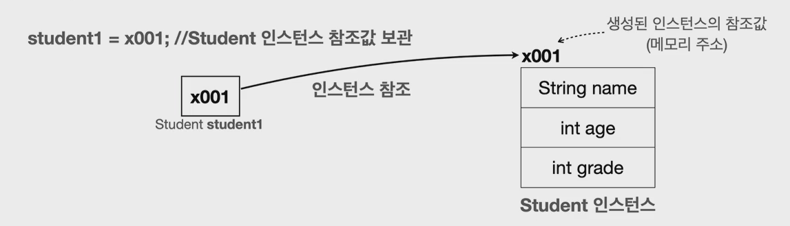

# 개요

자바에서 클래스가 필요한 이유와 생성 과정을 살펴보자


# 클래스가 필요한 이유

학생들을 관리하는 프로그램(?)을 만들어보자.

학생은 총 2명이고 각각 이름과, 나이, 성적을 관리하고 있다.


## 첫번째 방법 - 변수 사용

학생 개인 별로 변수를 사용하여 하드코딩(?) 한다.

```java
    public static void main(String[] args) {
        String student1Name = "학생1";
        int student1Age = 15;
        int student1Grade = 90;

        String student2Name = "학생2";
        int student2Age = 16;
        int student2Grade = 80;

        System.out.println("이름: " + student1Name + " 나이:" + student1Age + " 성적:" + student1Grade);
        System.out.println("이름: " + student2Name + " 나이:" + student2Age + " 성적:" + student2Grade);
    }
```

한계 : 학생이 늘어날 때 마다 변수를 추가로 선언해야 하고, 출력하는 코드도 추가해야한다.


## 두번째 방법 - 배열 사용

배열을 사용하여 관리한다.

```java
    public static void main(String[] args) {
        String[] studentNames = {"학생1", "학생2"};
        int[] studentAges = {15, 16};
        int[] studentGrades = {90, 80};

        for (int i = 0; i < studentNames.length; i++) {
            System.out.println("이름: " + studentNames[i] + " 나이:" + studentAges[i] + " 성적:" + studentGrades[i]);
        }
    }
```

한계 : 한 학생의 데이터를 관리하기 위해 3개의 배열(`studentNames`, `studentAges`, `studentGrades`)의 인덱스 순서를 정확하게 맞추어야 한다. 예를 들어서 `학생2` 의 데이터를 제거하려면 각각의 배열마다 `학생2` 의 요소를 정확하게 찾아서 제거해 주어야 한다.


## 세번째 방법 - 클래스 사용

학생 클래스를 만들어 관리한다.

- `class` 키워드를 사용하여 학생 클래스를 정의한다. 클래스 내부에는 `이름`, `나이`, `성적` 변수를 가진다. (멤버변수, 필드라고 부른다)
- 클래스는 관례상 대문자로 시작하고 낙타 표기법을 사용한다.

```java
public class Student {
    String name;
    int age;
    int grade;
}
```


클래스는 설계도이고, 이 설계도를 기반으로 실제 메모리에 만들어진 실체를 `객체` 또는 `인스턴스`라 한다. (둘다 같은 의미), 아래 코드에서는 학생(`Student`) 클래스를 기반으로 학생1(`Student1`), 학생2(`Student2`) 객체 또는 인스턴스를 만들었다.

```java
public static void main(String[] args) {
        Student student1 ;
        student1 = new Student();
        student1.name = "학생1";
        student1.age = 15;
        student1.grade = 90;

    	Student student2 = new Student();
        student2.name = "학생2";
        student2.age = 16;
        student2.grade = 80;

    	System.out.println(student1);
    	System.out.println(student2);

    	System.out.println("이름: " + student1.name + "나이: " + student1.age + " 등급 : " + student1.grade);
        System.out.println("이름: " + student2.name + "나이: " + student2.age + " 등급 : " + student2.grade);
    }
```

* `Student student1;` 은 변수를 선언한 것이다.
* `new Student()`는 `Student` 클래스 정보를 기반으로 새로운 객체를 생성하라는 것이다.
  * 이렇게 하면 메모리에실제 `Student` 객체(인스터스)를 생성한다.
* `Student` 클래스는 `String name`, `int age,` `int grade` 멤버 변수를 가지고 있다. 이 변수를 사용하는데 필요한 메모리 공간도 함께 확보한다.

### 참조값 보관

- 객체를 생성하면 자바는 메모리 어딘가에 있는 이 객체에 접근할 수 있는 참조값(주소) ( ex. x001)을 반환한다.
- `new` 키워드를 통해 객체가 생성되고 나면 참조값을 반환한다. 위에서 선언한 변수인 `Student student1 `에 생성된 객체의 참조값 (x001) 을 보관한다.
- 따라서 이 변수를 통해서 객체를 접근(참조) 할 수 있다.



* `student1` 과 `student2` 는 각각 다른 주소 값을 가지고 있다. (즉, 생성 할때 마다 매모리에 새롭게 만들어진다.)


