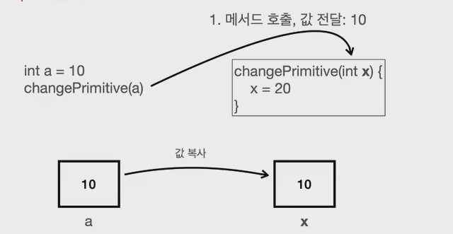
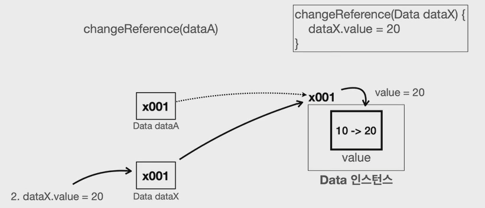

# 개요

Java에서 기본형과 참조형을 무엇인지 알아보고 각 상황에서의 차이를 알압자


# 기본형와 참조형

- 기본형(Primitive Type) : `int`, `long`, `double`, `boolean` 처럼 변수에 사용할 값을 직접 넣을 수 있는 데이터 타입.
- 참조형(Reference Type) : `Student student1`, `int[] students`와 같이 데이터에 접근하기 위한 참조(주소)를 저장하는 데이터 타입.

기본형 변수에는 직접 사용할 수 있는 값이 들어있지만, 참조형 변수에는 위치(참조값)가 들어가 있다. 참조형 변수를 통해서 뭔가 하려면 결국 참조값을 통해 위치로 이동해야한다.

> **중요**
>
> 자바는 항상 변수의 값을 복사해서 대입한다.
>
> - 자바에서 변수에 값을 대입하는 것은 들어 있는 값을 복사해서 대입하는 것이다.
> - 기본형, 참조형 모두 항상 변수에 있는 값을 복사해서 대입한다. 기본형이면 변수에 들어있는 실제 사용하는 값을 복사해서 대입하고, 참조형이면 변수에 들어있는 참조값을 복사해서 대입한다.

기본형은 변수에 값을 대입하더라도 실제 사용하는 값이 변수에 바로 들어있기 때문에 해당 값만 복사해서 대입한다고 생각하면 쉽게 이해할 수 있다.

```java
int a = 10;
int b = a;
```

그런데 참조형의 경우 실제 사용하는 객체가 아니라 객체의 위치를 가리키는 참조값만 복사된다. 쉽게 이야기해서 실제 건물이 복사가 되는 것이 아니라 건물의 위치인 주소만 복사되는 것이다. 따라서 같은 건물을 찾아갈 수 있는 방법이 하나 늘어날 뿐이다.

```java
Student s1 = new Student();
Student s2 = s1;
```

> **String**
>
> `String`은 사실 클래스이므로 참조형이다. 그런데 기본형처럼 문자 값을 바로 대입할 수 있는데, 문자는 매우 자주 다루기 때문에 자바에서 특별하게 편의 기능을 제공한다.


# 변수 대입

기본형과 참조형에서 변수를 대입했을 때 값의 차이를 알아보자.

## 1. 기본형

```java
    public static void main(String[] args) {
        int a = 10;
        int b = a;
        System.out.println("a = " + a);
        System.out.println("b = " + b);

        // a 변경
        a = 20;
        System.out.println("변경 a = 20");
        System.out.println("a = " + a); // 20
        System.out.println("b = " + b); // 10

        // b 변경
        b = 30;
        System.out.println("변경 b = 30");
        System.out.println("a = " + a); // 20
        System.out.println("b = " + b); // 30
    }
```

```
a = 10
b = 10
변경 a = 20
a = 20
b = 10
변경 b = 30
a = 20
b = 30


```

## 2. 참조형

변수의 대입은 변수에 들어있는 값을 복사해서 대입한다. 변수 `dataA`에는 참조값` x001`이 들어있다. 여기서는 변수 `dataA`에 들어있는 참조값 `x001`(예시)을 복사해서 변수 `dataB`에 대입한다. 

참고로 변수 `dataA`가 가리키는 인스터스를 복사하는 것이 아니다. 변수에 들어있는 참조값만 복사해서 전달한다. 이제 `dataA`와 `dataB`는 같은 참조값을 가지고, 두 변수는 같은 객체 인스턴스를 참조하게 된다.

```java
    public static void main(String[] args) {
        Data dataA = new Data();
        dataA.value = 10;
        Data dataB = dataA;

        System.out.println("dataA 참조값 = " + dataA);
        System.out.println("dataB 참조값 = " + dataB);
        System.out.println("dataA.value = " + dataA.value); // 10
        System.out.println("dataB.value = " + dataB.value); // 10

        // dataA변경
        dataA.value = 20;
        System.out.println("변경  dataA.value = 20");
        System.out.println("dataA.value = " + dataA.value); // 20
        System.out.println("dataB.value = " + dataB.value); // 20

        // dataB변경
        dataB.value = 30;
        System.out.println("변경 dataB.value = 30");
        System.out.println("dataA.value = " + dataA.value); // 30
        System.out.println("dataB.value = " + dataB.value); // 30
    }
```

```
dataA 참조값 = ref.Data@404b9385
dataB 참조값 = ref.Data@404b9385
dataA.value = 10
dataB.value = 10
변경  dataA.value = 20
dataA.value = 20
dataB.value = 20
변경 dataB.value = 30
dataA.value = 30
dataB.value = 30

```


# 메서드 호출

자바에서 메서드의 매개변수(파라미터)는 항상 값에 의해 전달된다. 그러나 이 값이 실제 값이냐, 참조(메모리 주소)값이냐에 따라 동작이 달라진다.

- 기본형 : 메서드로 기본형 데이터를 전달하면, `해당 값이 복사되어 전달한다`*.* 이 경우, 메서드 내부에서 파라미터의 값을 변경해도, `호출자의 변수 값에는 영향이 없다.`
- 참조형 : 메서드로 참조형 데이터를 전달하면, 참조값이 복사되어 전달된다. 이 경우, 메서드 내부에서 파라미터로 전달된 객체의 멤버 변수를 변경하면, `호출자의 객체도 변경된다.`


## 1. 기본형

```java
    public static void main(String[] args) {
        int a = 10;
        System.out.println("메서드 호출 전: a = " + a);
        changePrimitive(a);
        System.out.println("메서드 호출 후: b = " + a);
    }

    static void changePrimitive(int x) {
        x = 20;
    }
```

결과

```
메서드 호출 전: a = 10
메서드 호출 후: b = 10
```

메서드를 호출할 때 매개변수 x에 변수 a의 값을 전달한다. 이 코드는 다음과 같이 해석 할 수 있다.

```java
int x = a;
```

자바에서 변수에 값을 대입하는 것은 항상 값을 복사해서 대입한다. 따라서 변수 a, x 각각 숫자 10을 가지고 있다. 참고로 메서드가 종료되면 매개변수 x는 제거된다.



## 2. 참조형

```java
public static void main(String[] args) {
        Data dataA = new Data();
        dataA.value = 10;
        System.out.println("메서드 호출 전: dataA.value = " + dataA.value);
        changeReference(dataA);
        System.out.println("메서드 호출 후 : dataA.value = " + dataA.value);
    }

    static void changeReference(Data dataX) {
        dataX.value = 20;
    }
```

결과

```java
메서드 호출 전: dataA.value = 10
메서드 호출 후 : dataA.value = 20
```

메서드를 호출할 때 매개변수 `dataX`에 변수 `dataA`의 값을 전달한다. 이 코드는 다음과 같이 해석할 수 있다.

```java
int dataX = dataA;
```

자바에서 변수에 값을 대입하는 것은 항상 값을 복사해서 대입한다. 변수 `dataA`는 참조값 `x001`을 가지고 있으므로 참조값을 복사해서 전달했다. 따라서 변수 `dataA`, `dataX `둘다 같은 참조값인 `x001`을 가지게 된다. 이제 `dataX`를 통해서도 `x001`에 있는 `Data `인스턴스에 접근할 수 있다.

메서드를 보면, 메서드 안에서 `dataX.value = 20`으로 새로운 값을 대입한다. 참조값을 통해 `x001` 인스턴스에 접근하고 그 안에서 `value`의 값을 20으로 변경했다. `dataA`, `dataX `모두 같은 `x001 `인스턴스를 참조하기 때문에 `dataA.value` 와 `dataX.value` 는 둘다 20이라는 값을 가진다.


